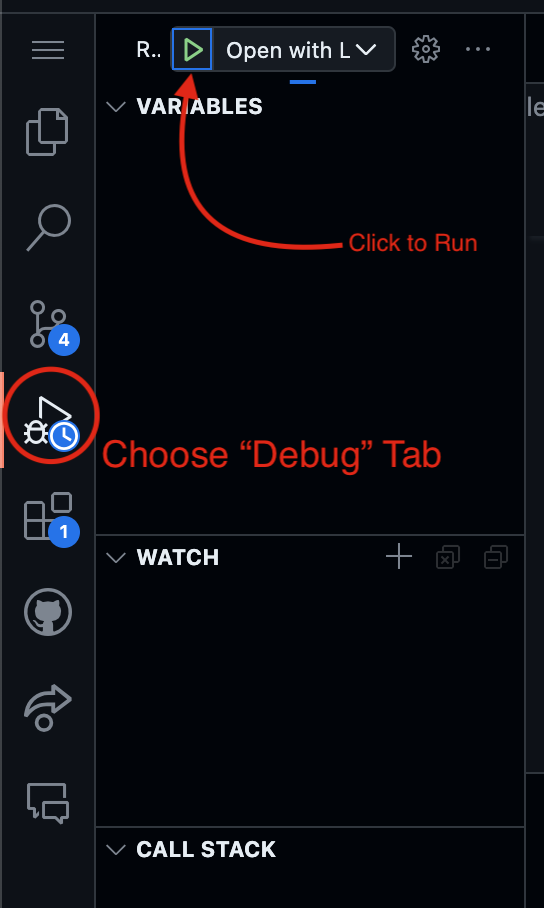
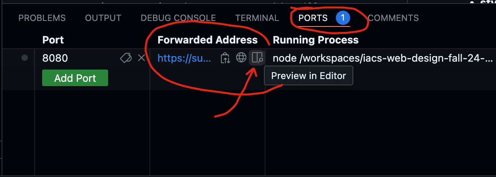
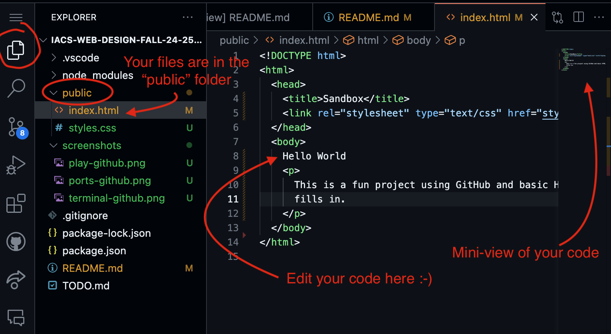
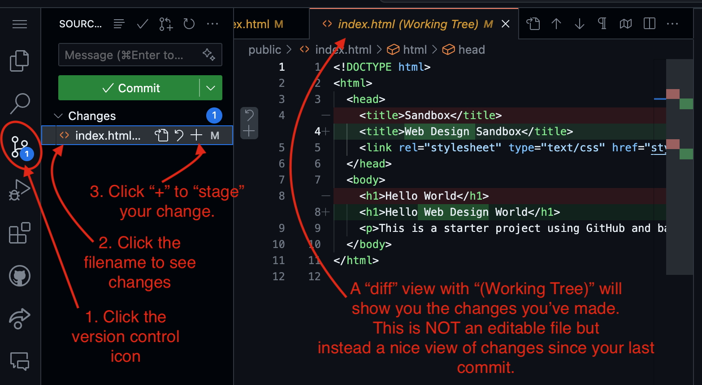
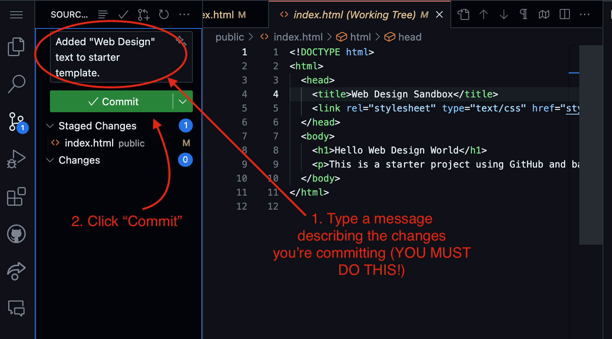
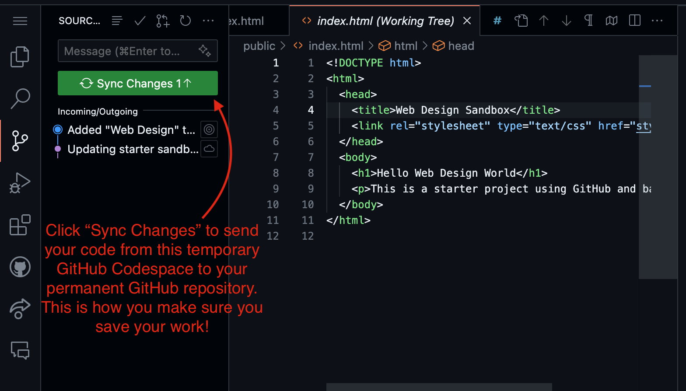
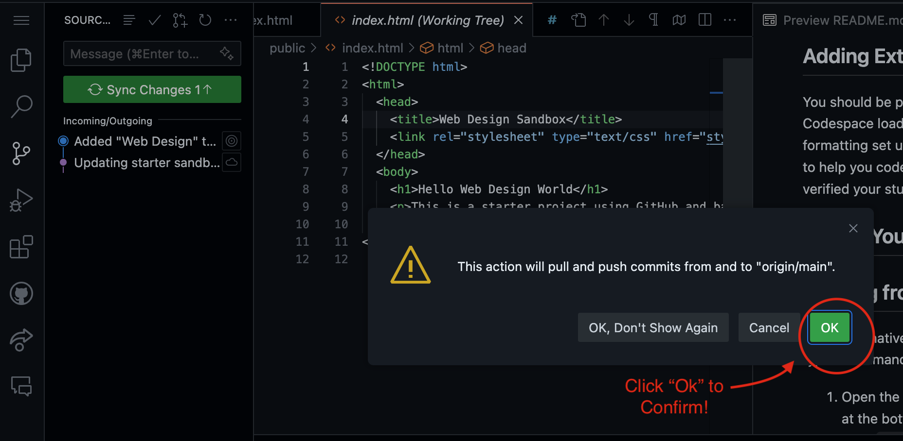
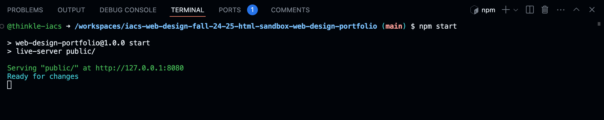

# Simple Web Design Project

Welcome to our simple web design sandbox! This project is designed to help you get started with HTML, CSS, and JavaScript in an easy-to-understand environment.

Instructions for understanding GitHub CodeSpaces are below.

In this document, you will find:

- [How to "run" your page](#running-the-project)
- [How to see your page side-by-side](#viewing-your-project)
- [Editing your files](#editing-your-project)
- [Setting up Codespaces Extensions](#adding-extensions)
- [Saving your work to version control](#saving-your-work-to-version-control)
- [Adding Images](#adding-images)

## Running the Project

1. Open the project in VS Code.
2. Click on the "Run and Debug" button on the sidebar (it looks like a play button).
3. Select "Open with Live Server" from the drop-down menu.
4. Click the green play button. This will start a local server and open your project in a web browser.
5. If this fails, you could try to [start from the terminal instead](#starting-from-the-terminal)
   

## Viewing Your Project

- You should see a pop up asking if you want to open the page after you hit "play" to run your project. If you click on it, it will open your webpage in a new tab.
- You can click on "Ports" at the bottom of the screen to see the web connection on your computer.

  If you hover over the "Forwarded Address" column, you'll see a "side-by-side" icon that will show
  the webpage inside your coding editor, or a "Globe" icon that will show the icon inside your web
  browser in a new tab.

## Editing Your Project

- Choose the "File Explorer" tab to see your files,
  and then look for your webpage code under the "public" folder.
  

- **index.html**: This is your HTML file. Edit it to change the structure of your web page.
- **style.css**: This is your CSS file. Modify it to change the styling of your web page.

### Files You Can Ignore

You don't need to worry about the following files and folders. They are used to set up and run your project environment:

- `package.json` and `package-lock.json`: Configuration files for Node.js.
- `node_modules`: A folder containing all the packages and dependencies for the project.
- `.vscode`: Contains configuration files for Visual Studio Code.

## Adding Extensions

You should be prompted to install extensions when this Codespace loads -- say yes and you'll
get automatic code formatting set up as well as github copilot (an AI tool to try to help you code). (To get CoPilot you'll need to have verified your student account with github)

## Saving Your Work to Version Control

Your "Codespace" is temporary (GitHub will keep it around for only a few weeks if you aren't using it actively), so you need to always save your work to version control after you are done.

GitHub version control can store all of your work as well as every change you've "committed", which means you can go back in time and see what changes
you made.

When you make changes to files, you will see the number of uncommitted changes you've made show up on the version control icon on the sidebar.

1. Click on the version control icon to see what changes you've made. Then click "+" to "stage"
   the change (you could also undo your changes here
   if you wanted to go back to the last committed
   version in the future)
   

2. Type a "change log" message describing what you changed in your code and then click "Commit" to save your changes to your local version control.
   

3. Click "Sync Changes" to push your changes from the local GitHub Codespace to your permanent GitHub repository. You'll have to click a confirmation popup as well.
   
   

## Adding Images

### Naming Images

I recommend giving images simple filenames with no spaces or special characters.
You can rename images in GitHub by selecting the file and pressing "Enter" or choosing
"Rename" from the right-click menu.

### Image Rights

Before you upload images to your project, you should make sure you have the right to
use them, either because you created them yourself, or because you found an image in
the public domain or with a creative commons license that allows re-use. Wikipedia
or the Wikimedia commons can be good sources of reusable images. 

### Adding Images to GitHub CodeSpaces

You can add images or other files to your project in GitHub Codespaces either
by dragging and dropping them onto the File Explorer or by using the right-click
menu and selecting upload.

If you put files in the wrong place, you can drag-and-drop to move them.

Images you want to include in your project should be in the "public" folder. 
I recommend organizing them inside of a separate "images" folder for easy
file management.

## Starting from the Terminal

As an alternative to using the "Play" button, you can also
type a command to run your project locally.

1. Open the terminal in VS Code (use the "Terminal" tab at the bottom)
2. Type `npm start` and press Enter. This will start a local server and open your project in a web browser.
   
